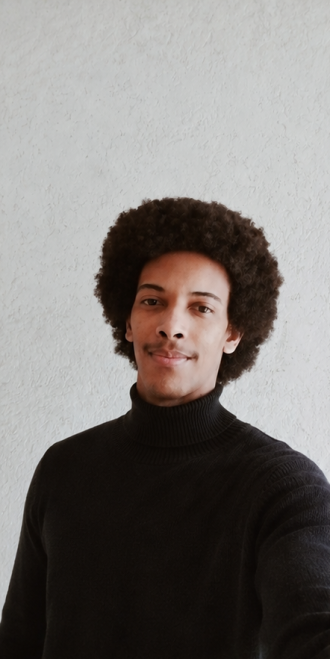
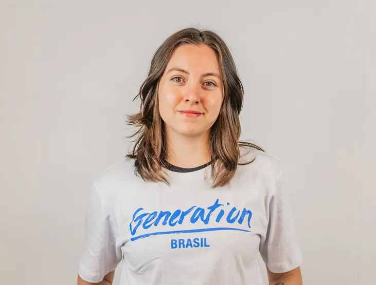
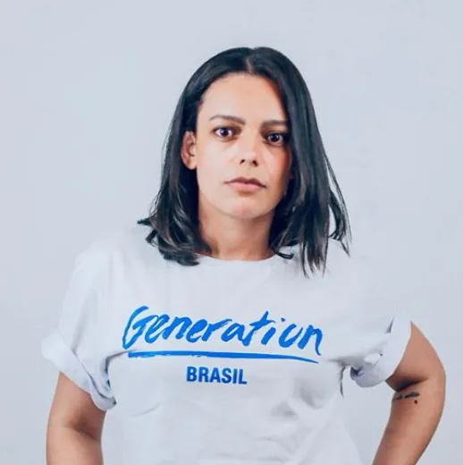

<h1 align="center"> 📊 Big Five Group</h1>

  O <strong>Big Five Group</strong> é focado na construção de soluções para problemas reais através de tecnologia e programação de alta performance. Transformamos desafios complexos em autonomia e eficiência operacional para nossos parceiros.

## 🎯 Nosso Objetivo

Desenvolver ecossistemas tecnológicos robustos e escaláveis, focados na automação de processos, arquitetura de software moderna e otimização de fluxos operacionais. Nossa missão é entregar ferramentas que gerem impacto direto e resolvam gargalos reais do mercado.

## 🚀 Sobre o Grupo

O Big Five Group unifica design inovador e engenharia de software para entregar aplicações que priorizam a experiência do usuário e a robustez técnica. Atuamos com:

- 📱 **Interfaces Modernas:** Desenvolvimento com foco em responsividade total (Mobile-First).
- 📊 **Inteligência de Dados:** Construção de painéis analíticos com indicadores e métricas em tempo real.
- 🗃️ **Gestão Inteligente:** Criação de tabelas dinâmicas e fluxos de dados otimizados para alta demanda.
- ⚡ **Performance:** Código limpo e arquitetura pensada para velocidade e escalabilidade.

---

## 🛠️ Tecnologias e Linguagens Utilizadas

  

Nossa stack é composta pelas ferramentas mais modernas e eficientes do mercado:

- **Frontend:** React, TypeScript, JavaScript (ES6+), Tailwind CSS (v4), CSS3 e HTML5.
- **Backend:** Node.js para construção de soluções lógicas e APIs escaláveis.
- **Versionamento & Fluxo:** Git para governança de código e colaboração contínua.

---

## 💡 Diferenciais Técnicos

- **Arquitetura Baseada em Componentes:** Reaproveitamento de código e facilidade de manutenção.
- **Tailwind v4 Engine:** Estilização de altíssima performance com as últimas especificações do mercado.
- **Tipagem Segura:** Uso rigoroso de TypeScript para garantir previsibilidade e reduzir erros em produção.
- **Acessibilidade & Semântica:** Interfaces estruturadas para serem inclusivas e amigáveis aos mecanismos de busca.

---

## 👥 Nosso Time — Big Five Group

O sucesso de nossas soluções é fruto do esforço colaborativo de nosso time:

<table align="center">
  <tr>
    <td align="center">
      <a href="#">
         
        <b>Eduarda Aleixo</b>
      </a>
    </td>
    <td align="center">
      <a href="https://github.com/jjeanpedro03">
         
        <b>Jean Pedro</b>
      </a>
    </td>
    <td align="center">
      <a href="#">
         
        <b>Julio Aguiar</b>
      </a>
    </td>
    <td align="center">
      <a href="#">
         
        <b>Laís Sousa</b>
      </a>
    </td>
    <td align="center">
      <a href="#">
         
        <b>Wadssa Wacemberg</b>
      </a>
    </td>
  </tr>
</table>